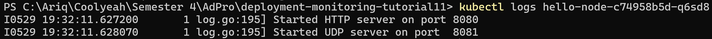
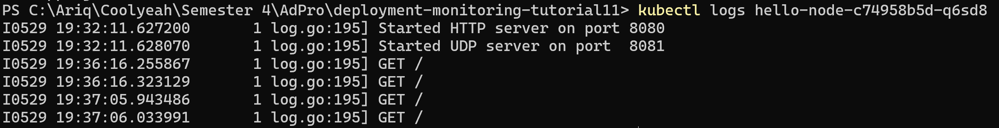

# Reflection on Hello Minikube

## 1. Compare the application logs before and after you exposed it as a Service. Try to open the app several times while the proxy into the Service is running. What do you see in the logs? Does the number of logs increase each time you open the app?

### Before application exposed as a Service

### After application exposed as a Service

Dari sini dapat disimpulkan bahwa jumlah logs bertambah setiap kali membuka app karena setiap request disimpan ke logs pod.

## 2. Notice that there are two versions of `kubectl get` invocation during this tutorial section. The first does not have any option, while the latter has `-n` option with value set to `kube-system`. What is the purpose of the `-n` option and why did the output not list the pods/services that you explicitly created?

Opsi -n (atau --namespace) pada kubectl get berfungsi untuk menentukan namespace target tempat perintah akan dijalankan; tanpa opsi ini, kubectl akan beroperasi pada namespace default di mana pod atau service yang dibuat (hello-node) biasanya berada. Namespace seperti kube-system dikhususkan untuk komponen inti Kubernetes, sehingga ketika menggunakan `kubectl get pods -n kube-system`, kita hanya melihat pod sistem dari Kubernetes itu sendiri, bukan aplikasi yang berada di namespace default yang berbeda.

