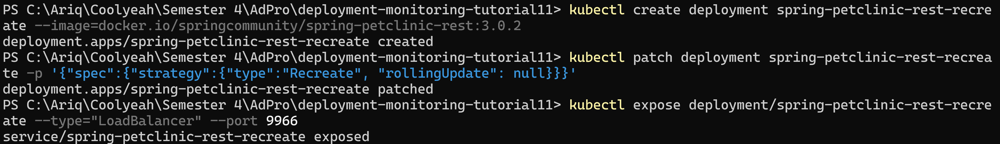

# Reflection on Hello Minikube

## 1. Compare the application logs before and after you exposed it as a Service. Try to open the app several times while the proxy into the Service is running. What do you see in the logs? Does the number of logs increase each time you open the app?

### Before application exposed as a Service

### After application exposed as a Service

Dari sini dapat disimpulkan bahwa jumlah logs bertambah setiap kali membuka app karena setiap request disimpan ke logs pod.

## 2. Notice that there are two versions of `kubectl get` invocation during this tutorial section. The first does not have any option, while the latter has `-n` option with value set to `kube-system`. What is the purpose of the `-n` option and why did the output not list the pods/services that you explicitly created?

Opsi -n (atau --namespace) pada kubectl get berfungsi untuk menentukan namespace target tempat perintah akan dijalankan; tanpa opsi ini, kubectl akan beroperasi pada namespace default di mana pod atau service yang dibuat (hello-node) biasanya berada. Namespace seperti kube-system dikhususkan untuk komponen inti Kubernetes, sehingga ketika menggunakan `kubectl get pods -n kube-system`, kita hanya melihat pod sistem dari Kubernetes itu sendiri, bukan aplikasi yang berada di namespace default yang berbeda.

# Reflection on Rolling Update & Kubernetes Manifest File

## 1. What is the difference between Rolling Update and Recreate deployment strategy?

Dalam Kubernetes, strategi Recreate akan mematikan semua pod versi lama sebelum membuat pod versi baru, yang menyebabkan adanya periode downtime aplikasi, namun sederhana dan memastikan hanya satu versi yang berjalan setelah transisi. Sebaliknya, strategi Rolling Update (yang merupakan default) secara bertahap mengganti pod lama dengan pod baru, memastikan aplikasi tetap tersedia selama proses update dengan menjalankan kedua versi secara bersamaan untuk sementara waktu, sehingga meminimalkan atau menghilangkan downtime dan memungkinkan rollback yang lebih aman, meskipun membutuhkan sumber daya lebih.

## 2. Try deploying the Spring Petclinic REST using Recreate deployment strategy and document your attempt.

Deploying dengan mengubah strategy type "Recreate" dan rollingUpdate menjadi null

Update versi dan informasi pods bahwa semua replica langsung dilakukan Terminate dan membuat replica baru dengan versi yang di update.

## 3. Prepare different manifest files for executing Recreate deployment strategy.

Mendapatkan deploymeny dan service manifest

## 4. What do you think are the benefits of using Kubernetes manifest files? Recall your experience in deploying the app manually and compare it to your experience when deploying the same app by applying the manifest files (i.e., invoking `kubectl apply -f` command) to the cluster.

Menggunakan file manifes Kubernetes, seperti file YAML, menawarkan keunggulan besar dibandingkan pendekatan manual dengan perintah kubectl satu per satu. Dengan manifes, kita mendefinisikan bagaimana seharusnya aplikasi berjalan. Mulai dari image yang digunakan, jumlah replika, hingga konfigurasi jaringan. File manifes ini dapat disimpan dalam sistem kontrol versi seperti Git, sehingga memberikan manfaat berupa pelacakan riwayat perubahan yang jelas, kemudahan untuk kembali (rollback) ke versi konfigurasi sebelumnya jika terjadi masalah, dan kemampuan audit yang baik. Hal ini juga memastikan konsistensi. konfigurasi yang sama dapat diterapkan berulang kali di lingkungan berbeda (development, staging, produksi) dengan hasil yang identik. Perintah `kubectl apply -f deployment.yaml` pun bersifat idempoten, artinya ia hanya akan menerapkan perubahan jika ada perbedaan antara manifes dan kondisi aktual di cluster. Secara keseluruhan, ini menyederhanakan pengelolaan aplikasi yang kompleks dan proses pembaruannya, menjadikannya metode yang jauh lebih andal dan terstruktur daripada perintah manual yang seringkali sulit dilacak, tidak konsisten, dan kurang terdokumentasi.

